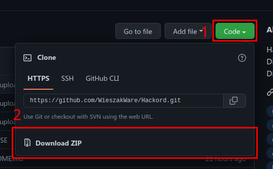

# **HACKORD**


[](https://www.python.org/downloads/release/python-3104/)
[](https://github.com/WieszakWare/Hackord/releases/latest)
[](https://github.com/wieszakware/hackord/stargazers)
[](https://github.com/wieszakware/hackord/network/members)

## **FAQ**
**Q:** What is Hackord?  
**A:** Hackord is automation tool for creation of discord account. 

**Q:** Why this even exists? I can create accounts manually.  
**A:** Creating accounts manually is absolute hassle, and you can be heavily rate limited by discord or sometimes even blocked for several days! Hackord aims to automate this process and also to bypass discord's limits.

**Q:** How can I be sure that it's not a virus?  
**A:**  As Hackord is open source you can look yourself into code and check what it is really doing, so it would be kinda stupid from our side to do anything sketchy.

**Q:** How do I use this?  
**A:** [Running Hackord](#running-hackord).

**Q:** Can I modify/redistribute Hackord?  
**A:** Hackord is licensed under [GPL V2](https://www.gnu.org/licenses/old-licenses/gpl-2.0.txt), so it means, **yes**, just don't steal our work.

**Q:** Can you add feature `x` and `y`.  
**A:** If you want to propose some features you can join our [discord server](https://discord.com/invite/KCqrbVgSBF) and discuss them in [leafuware-suggestions](https://discord.com/channels/943896316373766174/1034132943284748388).

**Q:** Hackord stopped working and give me some techical mumbo jumbo, **how the f\*\*\* am I supposed to get it to work?**  
**A:** First make sure you have [properly prepared Hackord](#running-hackord). If you believe you have done everything right, please first read [how to report bugs](#reporting-bugs). It contains list of what information we need in order to fix a bug and also where you can report those bugs.

**Q:** I have made some changes/fixes, can I submit them.  
**A:** **Of course!** We appreciate all help from our community and are open to any contribution made into our projects.


## **Running Hackord**
Some **VERY IMPORTANT** info before we start.  
- Owner of Hackord ~~unfortunately~~ is developing on Windows and because we don't have infinite time (school etc) we can't test Hackord on Linux/Mac OS. So if you happen to be running one of those systems and ran into some issues, please report them, as our goal is to make Hackord platform independent.  
- Hackord relies on `chromedriver` which is platform specific binary so in `chromedrivers` folder we provided binaries for Windows, MacOS and Linux, but if you have 32-bit computer or linux with custom kernel you might need to [download right binary](https://chromedriver.chromium.org/downloads) for your system, in a case of custom linux kernel, well... at this stage you should figure that out yourself.  
- For the sake of simplicity I am going to assume Hackord's folder is located on your desktop.

1. Download Hackord src.  
    *Option 1*: Download through github's interface.  
      
    **Note: You have to extract files from zip file.**  

    *Option 2*: Download using git (preferred as it's [easier to update]()).
    ```
    git clone --depth 1 https://github.com/WieszakWare/Hackord.git
    ```
2. Install Python 3.10.4, for **Windows** and **Mac OS** we recommend to download it from [python's website](https://www.python.org/downloads/release/python-3104/), and for **Linux** users use package manager of your choice and install it from your repositories.
3. Open Terminal/Konsole for your system.  
    **Windows**: Start Menu -> Type `cmd`.  
    **Linux**: Idk, just open terminal of your choice, shell... bash or zsh. Doesn't really matter.  
    **Mac OS**: Idk, I don't use mac but you should have terminal somewhere.
4. Navigate to Hackord's folder.  
    NOTE: Make sure that you replace `[HACKORD_FOLDER]` with name of your Hackord folder.  
    **Windows**:
    ```
    cd %USERPROFILE%/Desktop/[HACKORD_FOLDER]
    ```
    **Linux**:
    ```
    cd ~/Desktop/[HACKORD_FOLDER]
    ```
    **Mac OS**:
    ```
    cd ~/Desktop/[HACKORD_FOLDER]
    ```
5. Now type
    ```
    python main.py
    ```
    to launch Hackord.  
    In case you get `command "python" not found`, make sure you have installed Python properly as shown in step number 2.
    If you get error `can't open file 'main.py'`, make sure you have navigated into Hackord's directory as shown in step number 4.

## Updating Hackord.
As Hackord is still in development you will need to update it to use newest features and patch bugs, depending on how you downloaded it updating will differ.
- *Option 1*: Re-download zip file (follow option 1 in step 1 in [running hackord](#running-hackord) section)
- *Option 2*: Update using git (only if you downloaded Hackord using option 2 in step 1 in [running hackord](#running-hackord) section)  
    In Hackord's directory run:
    ```
    git fetch
    ```

## **That's it!**
You have successfully set-up Hackord!  
We hope that you are going to enjoy it.  
But as much as we love for it to be perfect, it can't be, just like in any other software. It do and will contain bugs and we **would love** to know about them. So if you have same spare time and you ran into some issues with Hackord please read [how to report bugs](#reporting-bugs). We are waiting for your feedback and help.

# **Reporting bugs**
## What we need to know:

- OS/Version (eg Windows 10/Arch Linux)  
    Note: If you are using linux please provide what terminal you are using, kernel and additional modification to system as they might be important.
- Full Hackord console output **(READ [HACKORD CONSOLE OUTPUT WARNING](#hackord-console-output-warning))**
- Bug Description.
- How to reproduce bug (what have you done).

## Things that you need to know:
**Note**: If you are on Windows, specify if you are running Hackord using python interpreter or our packed release binaries.  
**Note 2**: We are assuming that you are using newest stable version of Hackord, if it's not the case, please [update](#updating-hackord) your copy of Hackord and then check if issue still persists.  
**Note 3**: If you haven't please read [FAQ](#FAQ) and [running hackord](#running-hackord), ***BEFORE*** submitting issues.
### **HACKORD CONSOLE OUTPUT WARNING**
**WARNING: For operating/convenience/logging purposes Hackord may or may not display sensitive information for like device/hardware identifiers, user defined proxies, account names, email servers and tokens. It's your responsibility to black out those information as every issue reported will be publicly available and WE DO NOT TAKE ANY RESPONSIBILITY FOR YOUR MISTAKES.**
 
&nbsp;  
# **!!! DISCLAIMER !!!**
## **FOR EDUCATIONAL PURPOSES ONLY. HACKORD COMES WITH ABSOLUTELY NO WARRANTY. DEVELOPER/CONTRIBUTORS ARE NOT RESPONSIBLE FOR ANY DAMAGED CAUSED BY HACKORD OR ANY ACTION OF THE USER! USE IT AT YOUR OWN RISK!**
