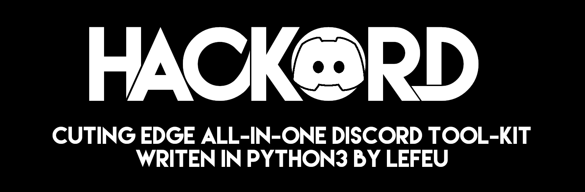

# **HACKORD**
  

## **FAQ**
**Q:** What is Hackord?  
**A:** Hackord is a tool-kit for automating actions like creating accounts, checking them, joining servers etc... 

**Q:** Why is it so buggy and lacks so many features?  
**A:** Currently Hackord is in active development and because it's a toolkit you can't expect *everything* to be *perfect*. With some time it will became more robust and feature rich. Just give it time.

**Q:** How can I be sure that it's not a virus?  
**A:** So first let me give you a timeline.
 - When this project was launched (V1 and betas) it was open source.
 - With Hackord V2, owner of Hackord has decided to take it close source.
 - Versions V2.0.0 - V2.0.3 are closed source.
 - From V2.0.4 to the future Hackord is going to be open source.  

And now that Hacord is open sorce you can have a look your self into the code, if you don't trust our binaries you can always build it yourself or just run from the source. Currently we are not providing any build instructions as we expect some computer literacy from you. But if you are lazy you can just fork this repository and run github actions as we have build scripts prepared for our project.

**Q:** Can you add feature **x**, **y** and fix **z**.  
**A:** Unfortunally currently we don't have too much time to develop Hackord and because of that we may not fix a bug or add proposed features as our priority is to at lease add all already planned features. And after that start polishing it. But you are free to join our [discord server](https://discord.com/invite/KCqrbVgSBF) and discouss about Hackord and other projects.

**Q:** **HELP HACKORD DOESN'T WORK AND HAVE ME SOME GOFFY AS FUCK SHIT, HOW TO FUCK AM I SUPPOSED TO GET IT UP AND RUNNING?!?!?!?!?!?!?!?!**  
**A:** Currently there's no documentation as project is in early development and some things can change overnight so for now you will have to figure it out yourself as Hackord is not currently plug&play tool and never will be. If you encountered some bug/corner case **that's not your fault**, please read [how to report bugs](#reporting-bugs). 

**Q:** Can I modify / redistribute this project?  
**A:** Short answer: [Licensed under GPL V2](https://www.gnu.org/licenses/old-licenses/gpl-2.0.txt)  
Long  answer: You are free to distribute and modify this program as long as it's licensed under GPL V2.0 and also properly credit our project.

# **Reporting bugs**
## What we need to know:

- OS/Version (eg Windows 10/Arch Linux)  
    Note: If you are using linux please provide distribution, kernel, graphical environment, terminal and shell.
- Full Hackord output **(READ [HACKORD CONSOLE OUTPUT WARNING](#hackord-console-output-warning))**
- How to reproduce bug (what have you done).
- Observed behavior (what you have saw).
- Excepted behavior (what really happened).

## Things that you need to know:
 - We are assuming that you are using newest stable version of Hackord. We are not accepting issues if they were preformed on outdated version of Hackord. Please update it first and then check if you can still reproduce issue.
 - We are not going to "*fish*" for the information. If you don't provide information we need when you open issue, it's just going to get closed.

## **HACKORD CONSOLE OUTPUT WARNING**
### **Hackord may or may not display a lot of sensitive information or data that is being generated by it. All issues opened are public and any edits are recorded and can be view. We take no responsibility for leaked data. It's in your business to black out information that you don't want other to see.**
 
&nbsp;  
# **!!! DISCLAIMER !!!**
## **FOR EDUCATIONAL PURPOSES ONLY. HACKORD COMES WITH ABSOLUTELY NO WARRANTY. DEVELOPER/CONTRIBUTORS ARE NOT RESPONSIBLE FOR ANY DAMAGED CAUSED BY HACKORD OR ANY ACTION OF THE USER! USE IT AT YOUR OWN RISK!**
